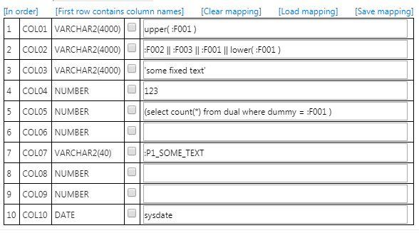

# Excel2APEX
A simple ETL-wizard plugin for Oracle APEX
The plugin is developed on APEX 4.0, but tested on 19.1. So I expect that it will run on most APEX versions in between.

- The included [demo application](demo/f80428_demo_application.sql) has an explanation
- See also the [demo application](https://apex.oracle.com/pls/apex/f?p=80428:1) on oracle.apex.com

If you like this plugin: [donations](https://www.paypal.me/apexplugins/3) are most appreciated :yum:.
